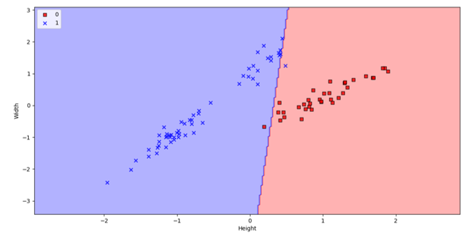
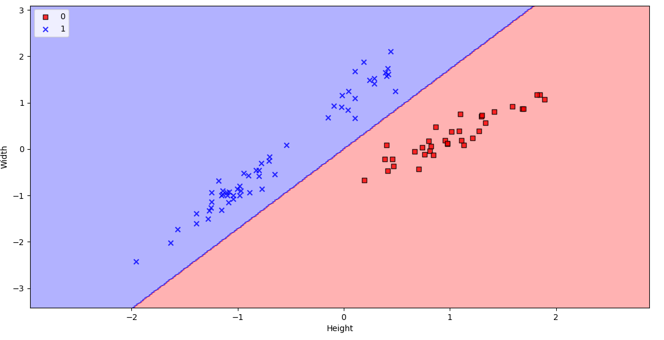
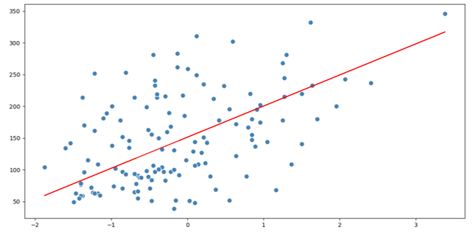
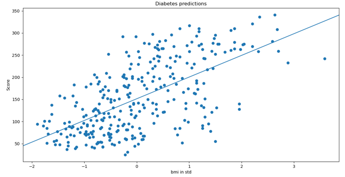
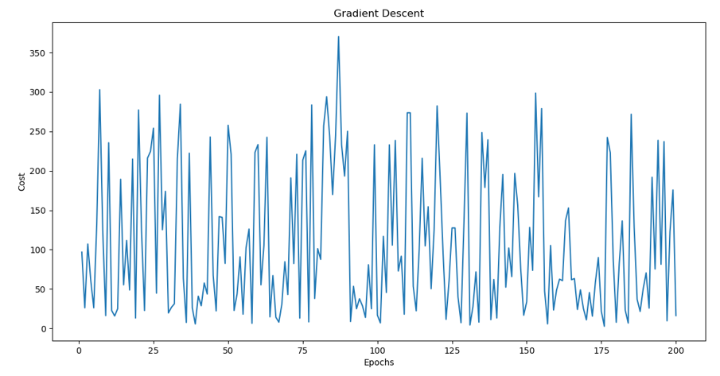
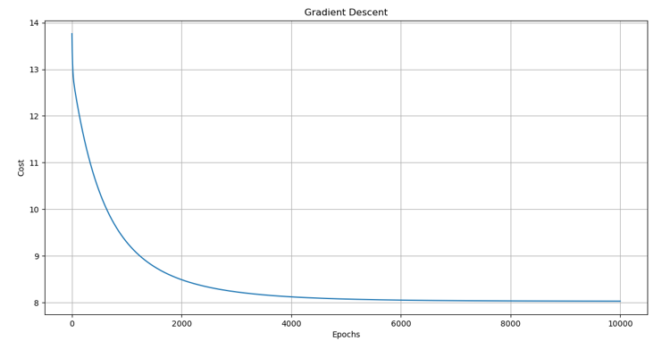
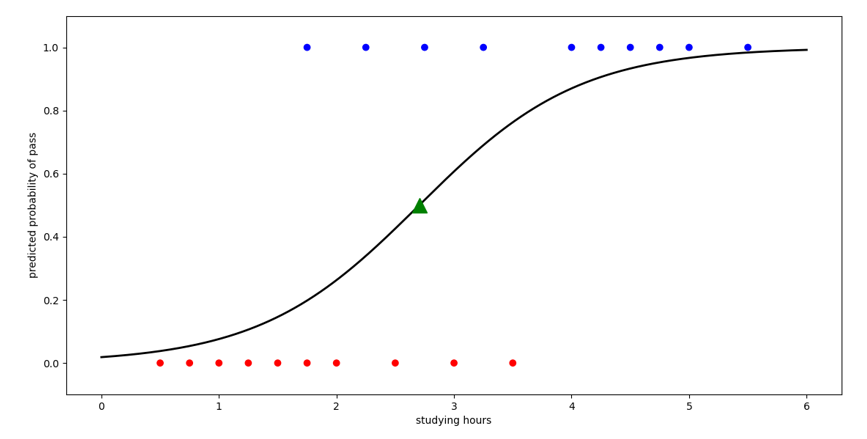
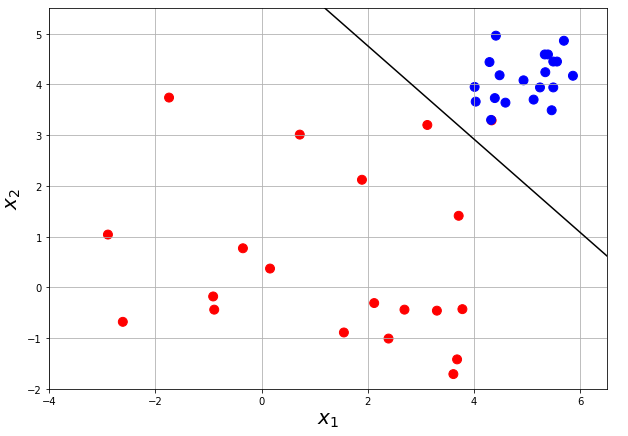

# machine_learning

## Perceptron: initialize weights with pseudo_inverse failed attempt

## Perceptron: initialize weights with pseudo_inverse successful attempt

## Linear regression

## Linear regression with pseudo_inverse

## Cost of stochastic gradient descent and mini batch gradient descent

## Cost of gradient descent

## Logistic regression on 1D data

## Logistic regression on 2D data

